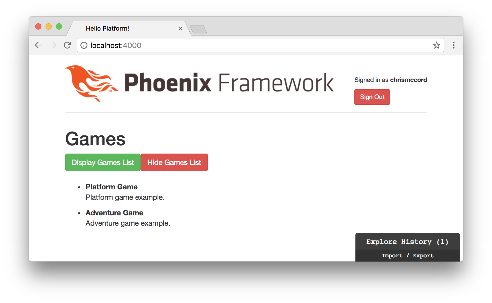
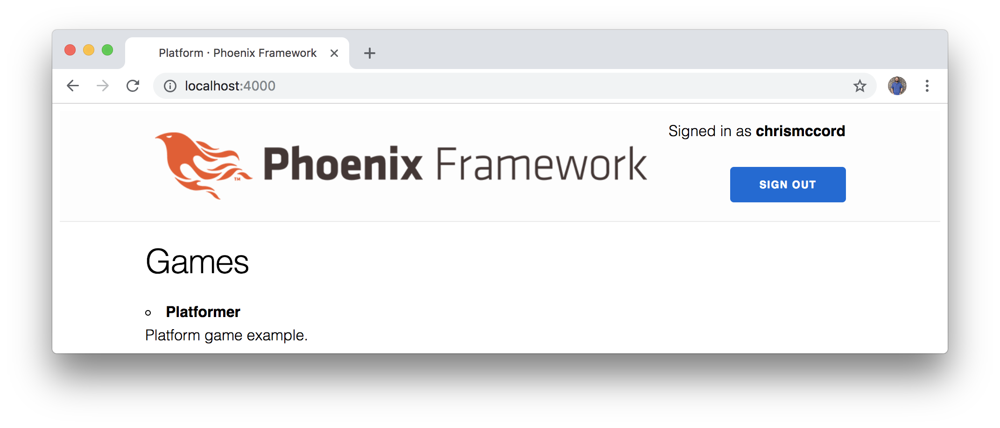

# Elm and API Data

Now that we have our Elm front-end application up and running, let's start
integrating it with our Phoenix application data. To start with, we can focus
on reading the game data from our API and rendering it on the page.

## Where Were We?

We currently have some hardcoded data in our Elm application that we're using
to display a list of games.

```elm
initialModel : Model
initialModel =
    { gamesList =
        [ { gameTitle = "Platform Game", gameDescription = "Platform game example." }
        , { gameTitle = "Adventure Game", gameDescription = "Adventure game example." }
        ]
    , displayGamesList = False
    }
```



Our next goal is to remove this hardcoded data and fetch the game JSON data
from our Phoenix API instead.


## Updating Our Initial Model

Let's start by clearing out the sample data we had been using to display our
list of games. We can also remove our buttons that display and hide the games
since we're going to show them by default. So we're removing the
`displayGamesList` field, and we're also going to add a new function called
`initialCommand` that we're going to use soon to fetch our data from the API.
Let's also go ahead and simplify our `Game` type by changing the field names
to `title` and `description`, which will help the fields match to the same
names that we have in our API.

Here is the full updated code for the model section:

```elm
type alias Model =
    { gamesList : List Game
    }


type alias Game =
    { title : String
    , description : String
    }


initialModel : Model
initialModel =
    { gamesList = []
    }


initialCommand : Cmd Msg
initialCommand =
    Cmd.none


init : ( Model, Cmd Msg )
init =
    ( initialModel, initialCommand )
```

## Changing the Update

We're also going to remove our `DisplayGamesList` and `HideGamesList` from the
update section and add a new action called `FetchGamesList`. For now, we'll
just set the `gamesList` to an empty list with `{ model | gamesList = [] }`,
but we'll assign the real data soon.

```elm
type Msg
    = FetchGamesList


update : Msg -> Model -> ( Model, Cmd Msg )
update msg model =
    case msg of
        FetchGamesList ->
            ( { model | gamesList = [] }, Cmd.none )
```

## Changing the View

Lastly, we'll need to update our view section. We can remove the buttons we
were using to display and hide the list of games. And we'll add a condition to
make sure our `gamesList` is not empty before we render the games section on
our page.

Here is the updated code for the view:

```elm
view : Model -> Html Msg
view model =
    if List.isEmpty model.gamesList then
        div [] []
    else
        div []
            [ h1 [ class "games-section" ] [ text "Games" ]
            , gamesIndex model
            ]
```

We'll also need to make a slight change to our `gamesListItem` function since
we changed the field names in our `Game` type.

```elm
gamesListItem : Game -> Html msg
gamesListItem game =
    li [ class "game-item" ]
        [ strong [] [ text game.title ]
        , p [] [ text game.description ]
        ]
```

## Importing Packages

Our goal for the rest of the chapter is going to be to make an HTTP request to
our Phoenix back-end for our JSON game data (`http://0.0.0.0:4000/api/games`),
and then to decode that JSON into our Elm application. To get started, let's
import the libraries we'll need to use:

- [Http](http://package.elm-lang.org/packages/elm-lang/http/latest)
- [Json.Decode](http://package.elm-lang.org/packages/elm-lang/core/latest/Json-Decode)

From the command line inside the `assets` folder where our `elm-package.json`
file lives, type the following command:

```shell
$ elm-package install elm-lang/http
```

This should install the `Http` package for us, and here's what the output
should look like:

```shell
$ elm-package install elm-lang/http
To install elm-lang/http I would like to add the following
dependency to elm-package.json:

    "elm-lang/http": "1.0.0 <= v < 2.0.0"

May I add that to elm-package.json for you? [Y/n] Y

Some new packages are needed. Here is the upgrade plan.

  Install:
    elm-lang/http 1.0.0

Do you approve of this plan? [Y/n] Y
Starting downloads...

  ● elm-lang/http 1.0.0

Packages configured successfully!
```

With that completed, we can now add the `import` statements to the top of our
`Main.elm` file. Here's what the top of the file should look like:

```elm
module Main exposing (..)

import Html exposing (..)
import Html.Attributes exposing (..)
import Html.Events exposing (onClick)
import Http
import Json.Decode as Decode
```

Note that we're importing our new `Http` library to make the HTTP request to
our endpoint, and we're also importing the `Json.Decode` library from the core
and giving it an alias of `Decode` to make things a little easier on ourselves.

## Fetching Games

Now that we have our libraries imported, the first step we need to take is to
make an HTTP GET request to our endpoint. If we take a look at the
[documentation for `Http.get`](http://package.elm-lang.org/packages/elm-lang/http/latest/Http#get),
we see that this function takes a string value for the URL as the first
argument and a JSON decoder as the second argument.

Keep in mind that the order of your functions doesn't matter, but I like to add
a new section for API functions below the model section. Here we'll create a
`fetchGamesList` function that make our `Http.get` request to our
`"/api/games"` route (and we'll get to the decoding soon).

```elm
fetchGamesList =
    Http.get "/api/games" decodeGamesList
```

We also want to trigger this request using the
[`Http.send`](http://package.elm-lang.org/packages/elm-lang/http/latest/Http#send)
function. So we'll pipe the results along with a new action we're going to
create.

There's a lot going on here, so don't worry if it's getting a little bit
confusing. It will all make more sense as we finish up with this initial
feature and then we'll do something similar for fetching our player data, which
will give us another opportunity to improve our understanding.

## JSON Decoding

Let's take another look at the structure of the JSON data we're getting from
our endpoint.

```json
{
    data: [
        {
            title: "Platformer",
            thumbnail: "http://via.placeholder.com/300x200",
            id: 1,
            featured: true,
            description: "Platform game example."
        }
    ]
}
```

It looks like a JSON object that contains a `data` list, which contains the
game data that we're actually looking for.

It's useful to think of decoding JSON from the inside out. This allows us to
focus on decoding the values we want to pull into our application, and then
take care of the details afterward. The fields that we're looking to pull from
our API are the `title` and `description`.

Let's create a `decodeGame` function, and we'll use the
[`map2`](http://package.elm-lang.org/packages/elm-lang/core/latest/Json-Decode#map2)
function since we're only looking to decode two fields. Note that we're also
using the `Json.Decode` package's
[`field`](http://package.elm-lang.org/packages/elm-lang/core/latest/Json-Decode#field)
function that allows us to safely ensure that the fields will contain the
correct type of data we're looking for (strings in our case).

```elm
decodeGame : Decode.Decoder Game
decodeGame =
    Decode.map2 Game
        (Decode.field "title" Decode.string)
        (Decode.field "description" Decode.string)
```

Next, we can pipe the results of our decoded game to the
[`list`](http://package.elm-lang.org/packages/elm-lang/core/latest/Json-Decode#list)
function and the
[`at`](http://package.elm-lang.org/packages/elm-lang/core/latest/Json-Decode#at)
function to finish decoding the full list of games in our API's data list.

```elm
decodeGamesList : Decode.Decoder (List Game)
decodeGamesList =
    decodeGame
        |> Decode.list
        |> Decode.at [ "data" ]
```

Here's what all the functions should look like together to make the HTTP
request to our JSON endpoint and decode the response:

```elm
fetchGamesList : Cmd Msg
fetchGamesList =
    Http.get "/api/games" decodeGamesList
        |> Http.send FetchGamesList


decodeGamesList : Decode.Decoder (List Game)
decodeGamesList =
    decodeGame
        |> Decode.list
        |> Decode.at [ "data" ]


decodeGame : Decode.Decoder Game
decodeGame =
    Decode.map2 Game
        (Decode.field "title" Decode.string)
        (Decode.field "description" Decode.string)
```

## FetchGamesList

Now we can handle the results of our HTTP request in our update section. The
type annotation may look a bit strange at first, but essentially we're creating
our `FetchGamesList` action and the result will either be successful or an
error. When the API fetch is successful, we'll get back our list of games. When
it's not successful, we'll get back and `Http.Error` that we can ignore for
now.

```elm
type Msg
    = FetchGamesList (Result Http.Error (List Game))
```

Inside the `update` function, we'll add a `result` argument to our
`FetchGamesList` action. And we'll add a `case` statement to handle the result.
When we get an `Ok` response, we update the `gamesList` in our model to contain
the list of games from our API. Otherwise, we'll just leave the model unchanged
if we get back and error.

```elm
update : Msg -> Model -> ( Model, Cmd Msg )
update msg model =
    case msg of
        FetchGamesList result ->
            case result of
                Ok games ->
                    ( { model | gamesList = games }, Cmd.none )

                Err _ ->
                    ( model, Cmd.none )
```

## Performing the Fetch

We've managed to make a ton of progress. We have all the functions we need to
create our HTTP request, decode the response, and render the results. All
that's left is to add our `fetchGamesList` as the `initialCommand` we run when
our application is initialized.

```elm
initialCommand : Cmd Msg
initialCommand =
    fetchGamesList
```

When the Elm runtime initializes our application, it takes our `initialModel`
(which contains an empty `gamesList`) and performs the `initialCommand` (which
will set our `gamesList` to the list of games from the API). The result is that
we're now fetching our data successfully from the API and rendering it in our
Elm application!



## TODO

- Reading JSON API data from Phoenix.
- Decoding JSON and working with game data in Elm.
- Displaying lists of both games and players.
- Sorting players by score?
- Simple layout design?
- Featured game in header?
