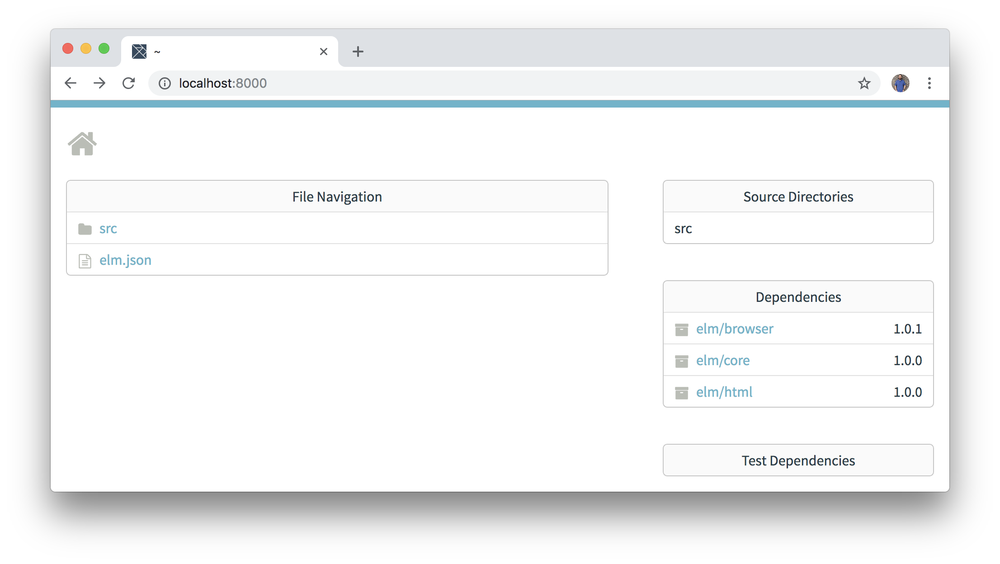
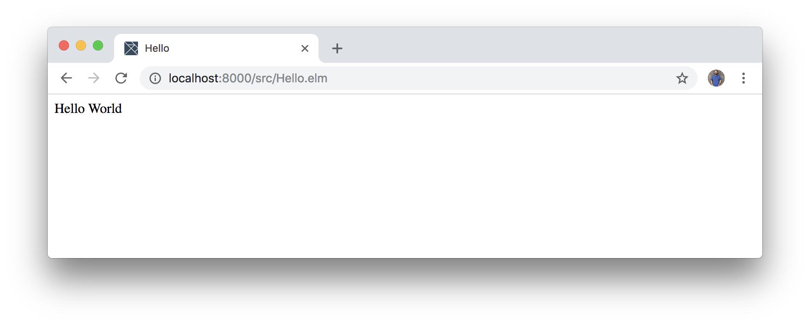

# Elm Introduction

We're going to build the front-end of our application using the Elm language.
That's going to involve using data from our back-end Phoenix application, and
decoding it into an Elm front-end application. Then, we'll also use Elm to
start building minigames for our platform. But before we get into all that,
let's take a quick look about what Elm is, how it works, and why we're so
eager to use it.

## Introduction

Elm is likely to look and feel a little foreign at first. But don't let that
scare you away, because it's a _very_ strong language that can be _very_ nice
to work with.

The design of Elm allows the language to offer things that many other languages
simply can't. Not only does it enable developers to write code that is free
from errors, but also results in code that is easier to refactor and more
maintainable.

I could go on for months about how great Elm is (and I do that at the local Elm
meetup that I help organize), but let's dive into some basic examples.

## Hello.elm

We can start with a simple "Hello World" example as a demonstration of how easy
it can be to get Elm up and running. Here's what a simple Elm program (with a
filename of `Hello.elm`) looks like:

```elm
module Hello exposing (..)

import Html


main =
    Html.text "Hello World"
```

The syntax is concise, and this serves as a quick way to display some text on a
page in the browser (we'll get to that in a second). But this is also a good
example in the sense that it shows a handful of things about Elm that might
seem unsettling at first. Where are all the parentheses and curly braces?
What's with the odd spacing?

## Elm Syntax

The first line is Elm boilerplate for defining our module. Since this is a
functional language, everything we do is essentially going to be modules and
functions. Functions will be _everything_ to us, and modules will help us
gather and organize all those functions. What we're saying with the first line
of code is that we're creating the `Hello` module, and "exposing" everything
(`..`) from it. So if someone wanted to use our application, they would just
need to import it and they could use any function they'd like.

## Modules, Functions, and Types

Speaking of imports, the next line says `import Html`. This allows us to use
any function from Elm's built-in
[Html library](http://package.elm-lang.org/packages/elm-lang/html/latest/Html).

The function that we're using in this program is the
[`Html.text`](http://package.elm-lang.org/packages/elm-lang/html/latest/Html#text)
function, which takes a single string as an argument. If we take a look at the
documentation for the `text` function, we can see the Elm type syntax:

```elm
text : String -> Html msg
```

That means when we added `Html.text "Hello World"` to our program, the `"Hello
World"` string was our only argument. And `Html msg` was the return type. Don't
worry too much about typing yet, but it's helpful to think about a couple of
quick things for now:

- How many arguments does a function take?
- What is the type of each argument?
- What is the type of the return value?

In our case, `text` is the name of the function. Then we use a `:` symbol
before the list of arguments. This function only takes a single argument, and
it's a `String`. Then, we use the arrow symbol `->` after the argument. Lastly,
we indicate the return type, which is an `Html msg`. The `msg` part isn't
important, and we could have said `Html a`. The important part is that we are
returning some HTML code that we are going to use to display the text on a page
in the browser.

## Main Function

The `main` function is basically the starting point for our application. When
we run it, the Elm runtime is going to look for `main`. But Elm is _way_ more
fun to play with than it is to read about, so let's finally run our example.

Before we can run Elm code, we'll need to install Elm. There are different
ways of doing it, but the easiest way is to use `npm` since most web developers
have [Node.js](https://nodejs.org/en/) installed already. Alternatively, there
are also installers available on the [Elm home page](http://elm-lang.org/).

```shell
$ npm install -g elm
```

That should be all you need. It globally installs the `elm` command on your
machine, so you can run it from the command line. In fact, type `elm` now and
take a look at the output:

```shell
$ elm
Elm Platform 0.18.0 - a way to run all Elm tools

Usage: elm <command> [<args>]

Available commands include:

  make      Compile an Elm file or project into JS or HTML
  package   Manage packages from <http://package.elm-lang.org>
  reactor   Develop with compile-on-refresh and time-travel debugging
  repl      A REPL for running individual expressions

You can learn more about a specific command by running things like:

  elm make --help
  elm package --help
  elm <command> --help

In all these cases we are simply running 'elm-<command>' so if you create an
executable named 'elm-foobar' you will be able to run it as 'elm foobar' as
long as it appears on your PATH.
```

We'll use all these features eventually, but for now let's focus on two of
them. First, let's create a temporary directory called `elm` that we'll use to
hold our Elm files, and then we'll use the `elm-package` command we see above
to fetch the libraries we need. Also note that we don't necessarily need to
place this folder inside our existing Phoenix application yet, and that we'll
take care of integrating Phoenix and Elm in the next chapter.

```shell
$ mkdir elm
$ cd elm
$ elm-package install
```

We're creating an empty `elm` folder, and then when we run `elm-package install`
it's going to create all the files we need:

```shell
$ elm-package install
Some new packages are needed. Here is the upgrade plan.

  Install:
    elm-lang/core 5.1.1
    elm-lang/html 2.0.0
    elm-lang/virtual-dom 2.0.4

Do you approve of this plan? [Y/n] Y
Starting downloads...

  ● elm-lang/virtual-dom 2.0.4
  ● elm-lang/html 2.0.0
  ● elm-lang/core 5.1.1

Packages configured successfully!
```

This is everything we need. Let's create the simple `Hello.elm` file for our
"Hello World" program:

```elm
module Hello exposing (..)

import Html


main =
    Html.text "Hello World"
```

All that's left is to run our program. Elm comes with a utility called
`elm-reactor` that we can use to serve our program locally and then access
it in our browser. Go ahead and run it from the command line:

```shell
$ elm-reactor
elm-reactor 0.18.0
Listening on http://localhost:8000
```

Now you can visit `http://localhost:8000` in your browser and see the files
and dependencies for our project. We only have a single Elm file (`Hello.elm`),
so let's click it to compile and see the results.





## elm-format

"Hello World" is admittedly not the most exciting example. But the good news is
that we have Elm installed and we have a simple program up and running.

Let's take a look a couple more things that will make our lives easier with
this example still in mind.

Before we move any further, definitely consider trying
[`elm-format`](https://github.com/avh4/elm-format). It's a plugin that you can
use with your editor that makes working with Elm much easier. It's particularly
great when you're getting started, because you can type a rough idea of what
you want to do and then immediately know if it's valid code as long as
`elm-format` reformats the code and doesn't mention errors or warnings.

While `elm-format` is not strictly necessary, and it's possible to write solid
Elm code without it, it's a remarkably helpful tool that can help you focus on
problem solving instead of worrying about valid syntax.

## Comments and Type Signatures

Let's go ahead and add a quick comment with the `-- comment` syntax to
indicate the filename at the top:

```elm
-- Hello.elm
module Hello exposing (..)

import Html


main =
    Html.text "Hello World"
```

Next, let's refactor our `import` statement slightly to be more explicit about
which functions we want to import from the `Html` module:

```elm
-- Hello.elm
module Hello exposing (..)

import Html exposing (Html, text)


main =
    text "Hello World"
```

We can also add a type signature for our `main` function:

```elm
-- Hello.elm
module Hello exposing (..)

import Html exposing (Html, text)


main : Html msg
main =
    text "Hello World"
```

When we create type signatures, we're restating the function name first. Then,
after the `:` character, we give the types of the arguments and the return
value. Since this function doesn't have any arguments, we're just giving the
return type here, which is `Html msg`. That just means we're returning some
HTML code when we return a value from the `Html.text` function that we're using.

The pipe operator we discovered in Elixir also works in Elm. In fact, we can
rewrite our "Hello World" text in all uppercase letters with the following:

```elm
-- Hello.elm
module Hello exposing (..)

import Html exposing (Html, text)


main : Html msg
main =
    "Hello World"
        |> String.toUpper
        |> text
```

Inside the `main` function, we start with the raw `"Hello World"` string. Then,
we pipe that to the
[`toUpper`](http://package.elm-lang.org/packages/elm-lang/core/latest/String#toUpper)
function from the
[`String`](http://package.elm-lang.org/packages/elm-lang/core/latest/String)
module. Then, we pipe the result of that to the `text` function that will
return the `Html msg` that our function is meant to return.

## Summary

There's a lot more to Elm than what we've covered in our simple "Hello World"
example. But this is a good start to get a look at the syntax and see that it's
not so scary as it might seem at first. In the next sections, we're going to
set up our Phoenix application to use Elm for the front-end. We're also going
to talk about the Elm Architecture, and how to pull data from our API into the
front-end application.
