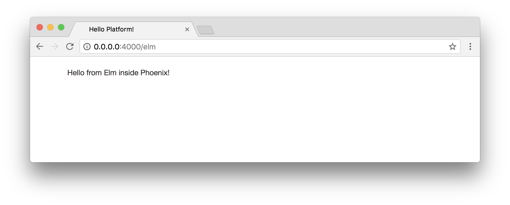

# Elm Single Page Application

We have Elm up and running in our Phoenix application. We've also gotten a very
brief introduction to Elm syntax, but we could use some practice writing Elm
code as we start to get an understanding of the concepts.

Although some of these concepts might feel unfamiliar at first, let's keep
moving and we'll increase our comfort level as we write small snippets of Elm
code that we'll incorporate into our platform.

## Getting Acquainted

One of the best ways to get acquainted with something new is to start with
something we're already familiar with. If we already know how to write HTML
code, we can use that knowledge as a bridge to learning Elm. Granted, Elm will
afford us opportunities to accomplish so much more than what we could with
HTML. But starting with the view will allow us to render something on the page
and give us something tangible to work with.

## elm-format

We mentioned this briefly in the Elm Intro chapter, but it bears repeating that
the [elm-format](https://github.com/avh4/elm-format) tool is _invaluable_ in
this situation. It will really help cut down on initial mistakes and make Elm
code easier to write.

## Converting Existing Code

Let's start with our existing `http://0.0.0.0:4000/elm` page. In the
`index.html.eex` file from the `lib/platform/web/templates/page` folder, let's
remove everything other than our Elm container. Here's what the file currently
looks like:

```embedded_elixir
<p class="well">Signed in as <strong><%= @current_user.username %></strong></p>
<span><%= link "List All Players", to: player_path(@conn, :index), class: "btn btn-info" %></span>
<span><%= link "Sign Out", to: player_session_path(@conn, :delete, @current_user), method: "delete", class: "btn btn-danger" %></span>

<div class="elm-container"></div>
```

We're going to add our authentication features back in later, but for now we
want this page to only contain our Elm application. So let's replace the code
above with the following:

```embedded_elixir
<div class="elm-container"></div>
```

At this point, we're displaying only a single line of text that's coming from
our Elm application:



## Main.elm

...