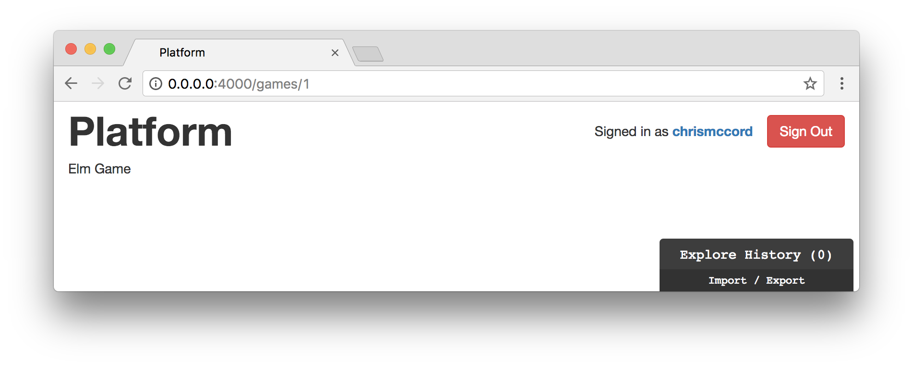

# Our First Game

Let's start creating our first minigame with Elm. We want to begin with
something small and simple that still has the characteristics and features we
want for our games.

Our initial game should be (very) small, self-contained, interactive, and fun.
And we'll also want to add a simple scoring mechanism so we can work towards
tracking player scores and sending that data to our back-end platform.

## Creating an Initial Game File

Inside the `lib/platform/web/elm` folder, let's create a new file named
`Game.elm`. We can initialize it with the following code so we'll have
something to display on the page:

```elm
module Game exposing (..)

import Html exposing (..)


main : Html msg
main =
    text "Elm Game"
```

## Creating a New Page for Games

On the Phoenix side, we'll need to create a new page where we can display our
game. We'll start by manually creating a new page and route, and later we'll
work towards a more flexible approach.

Inside the `lib/platform/web/templates/page` folder, let's create a new file
called `game.html.eex`. This will be very similar to what we did for our Elm
home page, and this time we'll just be creating a container div element for our
Elm game. This is all we need to add for the `game.html.eex` file:

```embedded_elixir
<div class="elm-game-container"></div>
```

Now let's update our `router.ex` file inside the `lib/platform/web` folder.
For now, we can add a simple route so that users can access our game by going
to `/elm/game` in the browser. Update the `router.ex` file with the following:

```elixir
scope "/", Platform.Web do
  pipe_through :browser

  get "/", PlayerController, :new
  get "/elm", PageController, :index
  get "/elm/game", PageController, :game
  resources "/players", PlayerController
  resources "/sessions", PlayerSessionController, only: [:new, :create, :delete]
end
```

When we visit `http://0.0.0.0:4000/elm/game` in our browser, we'll be able to
see the Elm game that we're creating. But we still need to take a couple
more steps before this works properly.

Let's update our `PageController` with a function that will render our new game
page. In the `lib/platform/web/controllers` folder, update the
`page_controller.ex` file with the following:

```elixir
defmodule Platform.Web.PageController do
  use Platform.Web, :controller

  plug :authenticate when action in [:index]

  def index(conn, _params) do
    render conn, "index.html"
  end

  def game(conn, _params) do
    render conn, "game.html"
  end

  defp authenticate(conn, _opts) do
    if conn.assigns.current_user() do
      conn
    else
      conn
      |> put_flash(:error, "You must be logged in to access that page.")
      |> redirect(to: player_path(conn, :new))
      |> halt()
    end
  end
end
```

## Configuring our Game Page

So we have our template, route, and controller configured properly, and we just
have a couple more small steps to take before we can see it rendered in the
browser.

First, we'll need to update our `brunch-config.js` file so that both `Main.elm`
and `Game.elm` will both be compiled (note that the only change here is on the
`elmBrunch` line).

```javascript
exports.config = {
  files: {
    javascripts: { joinTo: "js/app.js" },
    stylesheets: { joinTo: "css/app.css" },
    templates: { joinTo: "js/app.js" }
  },
  conventions: { assets: /^(static)/ },
  paths: {
    watched: ["../lib/platform/web/elm", "static", "css", "js", "vendor"],
    public: "../priv/static"
  },
  plugins: {
    babel: { ignore: [/vendor/] },
    elmBrunch: { elmFolder: "../lib/platform/web/elm", mainModules: ["Main.elm", "Game.elm"], outputFolder: "../../../../assets/vendor" }
  },
  modules: { autoRequire: { "js/app.js": ["js/app"] } },
  npm: { enabled: true }
};
```

Lastly, we can update our `app.js` file to render our game inside the Phoenix
application. At the bottom of our `assets/js/app.js` file, let's update our
code to look like this:

```javascript
const elmContainer = document.querySelector(".elm-container");
const elmGameContainer = document.querySelector(".elm-game-container");

if (elmContainer) {
  const elmApplication = Elm.Main.embed(elmContainer);
}

if (elmGameContainer) {
  const elmGame = Elm.Game.embed(elmGameContainer);
}
```

At this point, we should finally be able to see our new Elm game rendered in
the browser:



You also might be thinking, "This is the worst game ever. It literally just
says 'Elm Game' and that's it." You're right, and in the next sections we're
going to set up our Elm application, add SVG for our game's background, add a
little character to work with, and wire up the keyboard for interaction.

## Base Application for Our Game

We've already got some experience in the preceding chapters with the Elm
Architecture, so we're not going to cover it in great detail here. Instead,
we're going to start by pasting in the following code, which will give us some
starter code to work with. Add the following to the `Game.elm` file:

```elm

```
