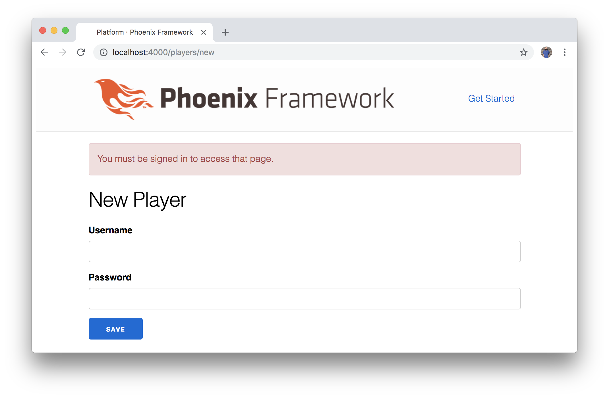
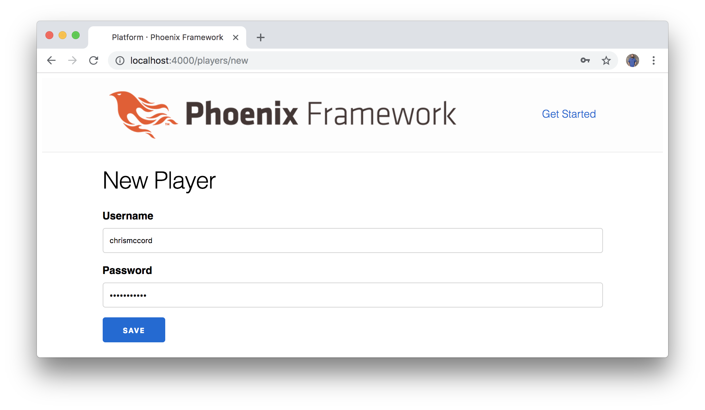
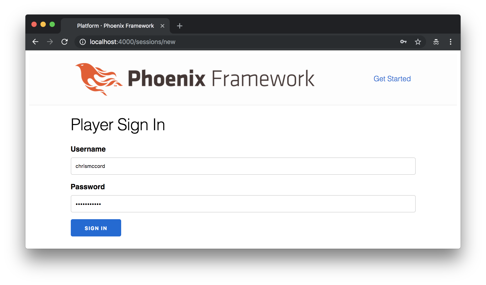

# Phoenix Authentication

In the last chapter, we managed to update our players with all the fields we'll
need. Now we can go ahead and implement our authentication features. We're
going to try to implement the bare minimum so that users can sign up and log in
to our platform, but we're not going to worry too much about more advanced
authentication features (forgotten password mailers, email verification, etc.).
Our goal is to allow users to sign up and log in quickly, easily, and securely.

## Fetching Dependencies

In order to get started with Phoenix authentication, we'll need to add a
dependency. In the root of our platform project, take a look at the `mix.exs`
file and find the `deps/0` function. This function is where we specify which
dependencies our application requires, and we can see that there are already a
handful that Phoenix uses by default.

```elixir
defp deps do
  [{:phoenix, "~> 1.3.0-rc"},
   {:phoenix_pubsub, "~> 1.0"},
   {:phoenix_ecto, "~> 3.2"},
   {:postgrex, ">= 0.0.0"},
   {:phoenix_html, "~> 2.6"},
   {:phoenix_live_reload, "~> 1.0", only: :dev},
   {:gettext, "~> 0.11"},
   {:cowboy, "~> 1.0"}]
end
```

The one we want to use to secure our passwords is called
[comeonin](https://hex.pm/packages/comeonin). This is what the syntax looks
like for adding a new dependency:

```elixir
{:comeonin, "~> 3.0"}
```

In Elixir, this syntax is called a tuple. It's used commonly as a way to store
keys and values like we need here. The first element of the tuple is an atom
(`:comeonin`), and the second element indicates the version number. So let's
update our `deps/0` function to look like this:

```elixir
defp deps do
  [{:phoenix, "~> 1.3.0-rc"},
   {:phoenix_pubsub, "~> 1.0"},
   {:phoenix_ecto, "~> 3.2"},
   {:postgrex, ">= 0.0.0"},
   {:phoenix_html, "~> 2.6"},
   {:phoenix_live_reload, "~> 1.0", only: :dev},
   {:gettext, "~> 0.11"},
   {:cowboy, "~> 1.0"},
   {:comeonin, "~> 3.0"}]
end
```

Save that file, and then from the command-line we'll run the `mix` command that
fetches dependencies:

```shell
$ mix deps.get
```

We'll see the following results:

```shell
$ mix deps.get
Running dependency resolution...
Dependency resolution completed:
  comeonin 3.0.2
  elixir_make 0.4.0
* Getting comeonin (Hex package)
  Checking package (https://repo.hex.pm/tarballs/comeonin-3.0.2.tar)
  Fetched package
* Getting elixir_make (Hex package)
  Checking package (https://repo.hex.pm/tarballs/elixir_make-0.4.0.tar)
  Fetched package
```

## Player Changesets

Let's update our existing `player_changeset/2` function inside the
`lib/platform/accounts/accounts.ex` file. We're going to add some validations
and a new function that will allow us to encrypt passwords so they're not
stored in plain text.

Below the `change_player/1` function, write the following code:

```elixir
defp player_changeset(%Player{} = player, attrs) do
  player
  |> cast(attrs, [:display_name, :password, :score, :username])
  |> validate_required([:username])
  |> validate_length(:username, min: 2, max: 100)
  |> validate_length(:password, min: 6, max: 100)
  |> put_pass_hash()
end

defp put_pass_hash(changeset) do
  case changeset do
    %Ecto.Changeset{valid?: true, changes: %{password: pass}} ->
      put_change(changeset, :password_hash, Comeonin.Bcrypt.hashpwsalt(pass))

    _ ->
      changeset
  end
end
```

This means we're able to make changes to all our player field data, and we're
adding a couple of quick validations to ensure data is structured properly.
More importantly, we're piping into our new `put_pass_hash/1` function, which
will encrypt passwords using the `comeonin` dependency that we added.

## Authentication Plug

Players are currently able to create new accounts at
`http://0.0.0.0:4000/players/new`. But we'll want to add features so that users
can log in and log out.


Let's make a new controller called `PlayerAuthController`. Create a
`lib/platform/web/controllers/player_auth_controller.ex` file, and add the
following content:

```elixir
defmodule Platform.Web.PlayerAuthController do
  import Plug.Conn

  alias Platform.Accounts

  def init(opts) do
    Keyword.fetch!(opts, :repo)
  end

  def call(conn, repo) do
    player_id = get_session(conn, :player_id)
    player = player_id && repo.get(Accounts.Player, player_id)
    assign(conn, :current_user, player)
  end
end
```

This will allow us to collect information about the player's session, and
assign it to `:current_user` so we can refer to that when handling our
authentication features.

## Router

Remembering back to when we set up our `PlayerController` in the Phoenix
router, we used the default browser pipeline. If we open the
`lib/platform/web/router.ex` file, we'll see that there are quite a few
`plug`s at the top:

```elixir
defmodule Platform.Web.Router do
  use Platform.Web, :router

  pipeline :browser do
    plug :accepts, ["html"]
    plug :fetch_session
    plug :fetch_flash
    plug :protect_from_forgery
    plug :put_secure_browser_headers
  end

  pipeline :api do
    plug :accepts, ["json"]
  end

  scope "/", Platform.Web do
    pipe_through :browser # Use the default browser stack

    get "/", PageController, :index
    resources "/players", PlayerController
  end

  # ...
end
```

At the bottom of the `pipeline :browser` block, add our new authentication
plug:

```elixir
pipeline :browser do
  plug :accepts, ["html"]
  plug :fetch_session
  plug :fetch_flash
  plug :protect_from_forgery
  plug :put_secure_browser_headers
  plug Platform.Web.PlayerAuthController, repo: Platform.Repo
end
```

This plug is going to allow us to restrict access to certain pages. Originally,
users were being taken to our index page from the `PageController` when they
accessed the default route (`/`). But we're going to turn that page into our
Elm single page application, and we'll require users to log in before they
access it.

For now, let's direct users to the **Player Sign Up Page** at `/players/new`
when they access the default route, and we'll restrict access to the
`PageController` index page, which we'll call `/elm` for now.

Here are the updates we'll need to make to our browser scope:

```elixir
scope "/", Platform.Web do
  pipe_through :browser

  get "/", PlayerController, :new
  get "/elm", PageController, :index
  resources "/players", PlayerController
end
```

When we access `http://0.0.0.0:4000` now, we'll see the
**Player Sign Up Page**.


And we can access `http://0.0.0.0:4000/elm` to see our original home page,
which we'll later turn into our Elm single page application.


## Authenticate Function

Currently, users are able to navigate to all the pages within our application.
We want to ensure that players are logged in before they access our Elm
application and start playing games.

At the bottom of our `PageController`, let's add an `authenticate/2`
function. Open up the `lib/platform/web/controllers/page_controller.ex` file
and add the following at the bottom (beneath the `index/2` function):

```elixir
defp authenticate(conn, _opts) do
  if conn.assigns.current_user() do
    conn
  else
    conn
    |> put_flash(:error, "You must be logged in to access that page.")
    |> redirect(to: player_path(conn, :new))
    |> halt()
  end
end
```

Since we assigned the current player's session to be the `current_user` inside
our `PlayerAuthController`, we can use that to determine whether a visitor to
our site is signed in. If they are, we'll just return the connection and allow
them to continue, otherwise if they're attempting to access a restricted
resource, we'll display a message and redirect them back to the
**New Player Page**.

In the same file, we'll use the `authenticate/2` function that we just created
to determine whether or not players should be able to render the
`PageController` index page.

Above the `index/2` function, add the following line of code:

```elixir
plug :authenticate when action in [:index]
```

## Manual Testing

If you're wondering if the updates above broke our tests, you're right. We
usually run our test suite with `mix test`, but this time let's fire up our
Phoenix server and manually test things out in the browser.

Start up the Phoenix server with `mix phx.server` and try going to the
`PageController` index page at `http://0.0.0.0:4000/elm`:



This is great, it redirects us back to the **Player Sign Up Page** because we
managed to restrict access to the `/elm` page. And we see the flash alert that
we wrote in the `authenticate/2` function at the bottom of the
`PageController`:

> You must be logged in to access that page.

## Fixing the Build

Let's push a quick and dirty fix for our tests. If we push our new features
as-is, they'll break the CI build. We could take this as an opportunity to
write more in-depth tests for our application, but for now we're still
figuring out where we want to put everything. We won't go too deep into writing
tests yet, but we still want to ensure that our application is always
functioning, and keeping our CI build green is a great way to do that.

Open the `test/web/controllers/page_controller_test.exs` file and replace it
with the following code that tests our default route and the redirect that
we created:

```elixir
defmodule Platform.Web.PageControllerTest do
  use Platform.Web.ConnCase

  test "GET /", %{conn: conn} do
    conn = get conn, "/"
    assert html_response(conn, 200) =~ "Player Sign Up"
  end

  test "redirects unauthenticated users for index page", %{conn: conn} do
    conn = get conn, page_path(conn, :index)
    assert html_response(conn, 302) =~ "redirect"
  end
end
```

Go ahead and run the `mix test` command again and we should be all set with
passing tests that give us confidence to keep adding features and moving
forward.

## Logging In

So how can we allow users to log in to their newly created accounts? Let's
define a `login/2` function in our `PlayerAuthController`:

```elixir
def login(conn, player) do
  conn
  |> assign(:current_user, player)
  |> put_session(:player_id, player.id)
  |> configure_session(renew: true)
end
```

Right after a new player creates an account, we automatically want to log them
into the system. So let's update the `create/2` function in our
`PlayerController`. We'll use the pipe operator to log the player in before we
display the flash message and redirect them:

```elixir
def create(conn, %{"player" => player_params}) do
  case Accounts.create_player(player_params) do
    {:ok, player} ->
      conn
      |> Platform.Web.PlayerAuthController.login(player)
      |> put_flash(:info, "Player created successfully.")
      |> redirect(to: player_path(conn, :show, player))
    {:error, %Ecto.Changeset{} = changeset} ->
      render(conn, "new.html", changeset: changeset)
  end
end
```

Let's try it out. Go to the `http://0.0.0.0:4000/players/new` page and create a
new user with both the `username` and `password` fields set to `joearms`:



So far so good. The new user we just created should be logged in. Let's try to
access the `PageController` index page to verify. Go to the
`http://0.0.0.0:4000/elm` page in your browser:


Success! We're able to access this page because we created a new account and
authenticated the new player at the same time.

## Sessions

To complete our authentication features, we'll need to handle user sessions. We
were able to handle logins in the previous section because we took care of it
while creating an account, but now we'll also want to allow users to log out and
log back in whenever they'd like.

Let's start by creating a `PlayerSessionController`. Create a new file called
`platform/lib/web/controllers/player_session_controller.ex`, and add the
following code:

```elixir
defmodule Platform.Web.PlayerSessionController do
  use Platform.Web, :controller

  def new(conn, _) do
    render conn, "new.html"
  end

  def create(conn, %{"session" => %{"username" => user, "password" => pass}}) do
    case Platform.Web.PlayerAuthController.login_by_username_and_pass(conn, user, pass, repo: Platform.Repo) do
      {:ok, conn} ->
        conn
        |> put_flash(:info, "Welcome back!")
        |> redirect(to: page_path(conn, :index))
      {:error, _reason, conn} ->
        conn
        |> put_flash(:error, "Invalid username/password combination.")
        |> render("new.html")
    end
  end

  def delete(conn, _) do
    conn
    |> Platform.Web.PlayerAuthController.logout()
    |> redirect(to: page_path(conn, :index))
  end
end
```

This may seem like a lot at first, but we'll go through it quickly along with
the updates we make to the `PlayerAuthController`.

The `new/2` function will allow us to display a login page (as opposed to the
sign up page that new players will use). When we create new sessions, we'll use
a new function (which we'll create soon) called `login_by_username_and_pass/4`.
Lastly, the `delete/2` function will allow us to log users out by deleting
their session.

## View and Template

Let's create the view and the template for our login page. Add a new file called
`player_session_view.ex` inside the `lib/platform/web/views` folder. And add the
following to the file:

```elixir
defmodule Platform.Web.PlayerSessionView do
  use Platform.Web, :view
end
```

And then we'll need to create the corresponding template. Create a
`lib/platform/web/templates/player_session` folder, and then add a
`new.html.eex` file inside with the following content:

```elixir
<h1>Player Sign In Page</h1>

<%= form_for @conn, player_session_path(@conn, :create), [as: :session], fn f -> %>
  <div class="form-group">
    <%= text_input f, :username, placeholder: "Enter username...", class: "form-control" %>
  </div>
  <div class="form-group">
    <%= password_input f, :password, placeholder: "Enter password...", class: "form-control" %>
  </div>
  <%= submit "Sign In", class: "btn btn-primary" %>
  <span><%= link "Create New Account", to: player_path(@conn, :new), class: "btn btn-success" %></span>
<% end %>
```

## Login Routing

If you were still running a Phoenix server this whole time, you've probably
noticed we've been creating errors in our application. But we're getting close
to a working authentication system. We'll need to update our router to reflect
our new session features. Open the `lib/platform/web/router.ex` file and add
our session resource:

```elixir
scope "/", Platform.Web do
  pipe_through :browser

  get "/", PlayerController, :new
  get "/elm", PageController, :index
  resources "/players", PlayerController
  resources "/sessions", PlayerSessionController, only: [:new, :create, :delete]
end
```

This will add only the necessary routes so our players can create and delete
their sessions to log in and out of the platform.

## Logging In and Out

Lastly, we'll create the function in our `PlayerAuthController` that ties
everything together. Add the `login_by_username_and_pass/4` function at the
bottom of the `lib/platform/controllers/player_auth_controller.ex` file, and
don't forget to add the `import` for our encryption at the top. Here's what
the full code should look like for the file:

```elixir
defmodule Platform.Web.PlayerAuthController do
  import Plug.Conn
  import Comeonin.Bcrypt, only: [checkpw: 2, dummy_checkpw: 0]

  def init(opts) do
    Keyword.fetch!(opts, :repo)
  end

  def call(conn, repo) do
    player_id = get_session(conn, :player_id)
    player = player_id && repo.get(Platform.Accounts.Player, player_id)
    assign(conn, :current_user, player)
  end

  def login(conn, player) do
    conn
    |> assign(:current_user, player)
    |> put_session(:player_id, player.id)
    |> configure_session(renew: true)
  end

  def login_by_username_and_pass(conn, username, given_pass, opts) do
    repo = Keyword.fetch!(opts, :repo)
    player = repo.get_by(Platform.Accounts.Player, username: username)

    cond do
      player && checkpw(given_pass, player.password_hash) ->
        {:ok, login(conn, player)}
      player ->
        {:error, :unauthorized, conn}
      true ->
        dummy_checkpw()
        {:error, :not_found, conn}
    end
  end

  def logout(conn) do
    configure_session(conn, drop: true)
  end
end
```

What the `login_by_username_and_pass/4` function does is to grab the player
from the database by their `username` field. If the player exists and has the
correct password, they will be logged in. Otherwise, we'll return an error.

## Trying Things Out

It's a good idea to try out these features using "incognito" browser windows.
That will give us a way to open a new browser window in a clean state. If
you're using Google Chrome on OS X, you can create a new incognito window with
`Command + Shift + N`. It's also a good idea to restart your Phoenix server
with `mix phx.server` at this point to get things up and running.

We can test out the **Player Sign In Page** with the same account that we
created in the previous sections. Go to the new session page at
`http://0.0.0.0:4000/sessions/new` and try entering `joearms` for both the
`username` and `password` fields.



Success! We get a welcome back message letting us know that we were able to
log in successfully:


## Displaying the Player Status

In the `lib/platform/web/templates/layout` folder, update the header section in
the `app.html.eex` file with the following:

```embedded_elixir
<div class="header">
  <ol class="breadcrumb text-right">
  <%= if @current_user do %>
    <li>Logged in as <strong><%= @current_user.username %></strong></li>
    <li><%= link "Log Out", to: player_session_path(@conn, :delete, @current_user), method: "delete" %></li>
  <% else %>
    <li><%= link "Sign Up", to: player_path(@conn, :new) %></li>
    <li><%= link "Log In", to: player_session_path(@conn, :new) %></li>
  <% end %>
  </ol>
  <span class="logo"></span>
</div>
```

## Summary

We've come a long way! We now have working features for players to create
accounts and log in on our platform. Next comes the fun stuff! We'll be
building out the games section for our platform, and getting our first taste of
what it's like to work with Elm.
