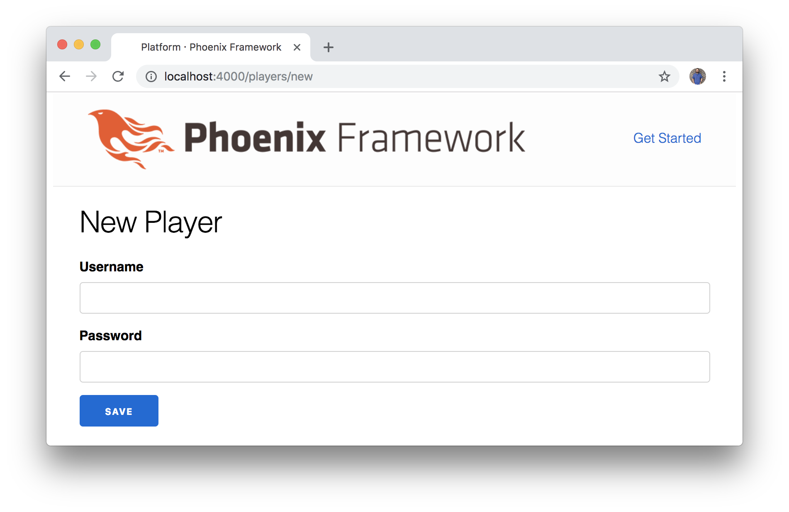
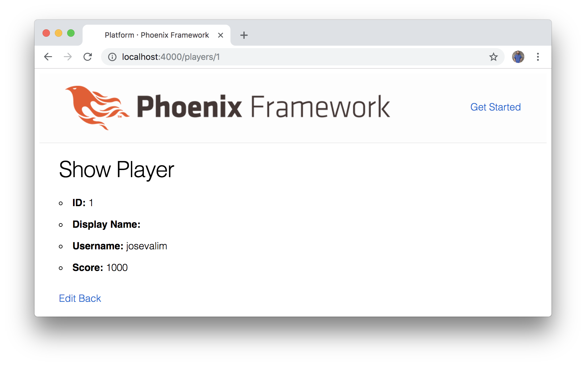
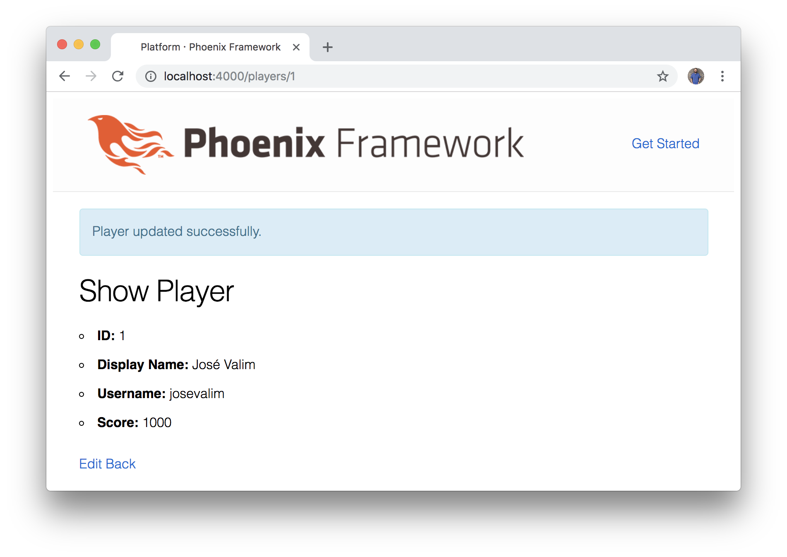

# Phoenix Sign Up

There are many different ways to handle authentication in our applications. In
our case, we're eager to start using Elm to build the front-end, but we're
going to start by allowing users to sign up and sign in with Phoenix. Later,
we'll refactor as we build our Elm single page application. For now, let's
add a quick way for players sign up and sign in by extending the player
features that we started earlier.

## Extending Players

Let's take a look at the player accounts we created previously. First, check
out the `lib/platform/accounts/accounts.ex` file:

```elixir
defmodule Platform.Accounts do
  @moduledoc """
  The boundary for the Accounts system.
  """

  import Ecto.{Query, Changeset}, warn: false
  alias Platform.Repo

  alias Platform.Accounts.Player

  @doc """
  Returns the list of players.

  ## Examples

      iex> list_players()
      [%Player{}, ...]

  """
  def list_players do
    Repo.all(Player)
  end

  # ...

end
```

Inside the `Platform.Accounts` module, it looks like there's a handy
`list_players/0` function available for us that will grab all the `Player`
records from the database. We can think of `Repo` as an abstraction for our
database, so `Repo.all(Player)` means that we'll query for all the players we
have stored.

We can test out this function using `iex` to interactively query for our
existing player records. First, we'll start the interactive Elixir prompt:

```shell
$ iex -S mix phx.server
```

Now we can query for our players with the following:

```elixir
iex> Platform.Accounts.list_players
[debug] QUERY OK source="accounts_players" db=3.0ms decode=3.7ms
SELECT a0."id", a0."score", a0."username", a0."inserted_at", a0."updated_at" FROM "accounts_players" AS a0 []
[%Platform.Accounts.Player{__meta__: #Ecto.Schema.Metadata<:loaded, "accounts_players">,
  id: 1, inserted_at: ~N[2017-04-08 14:55:28.674971], score: 1000,
  updated_at: ~N[2017-04-08 14:55:28.681607], username: "josevalim"},
 %Platform.Accounts.Player{__meta__: #Ecto.Schema.Metadata<:loaded, "accounts_players">,
  id: 2, inserted_at: ~N[2017-04-08 14:55:34.139085], score: 2000,
  updated_at: ~N[2017-04-08 14:55:34.139091], username: "evancz"}]
```

We can also look up a single player using the `get/2` function and the player's
`id` value:

```elixir
iex> Platform.Repo.get(Platform.Accounts.Player, 1)
[debug] QUERY OK source="accounts_players" db=2.2ms
SELECT a0."id", a0."score", a0."username", a0."inserted_at", a0."updated_at" FROM "accounts_players" AS a0 WHERE (a0."id" = $1) [1]
%Platform.Accounts.Player{__meta__: #Ecto.Schema.Metadata<:loaded, "accounts_players">,
 id: 1, inserted_at: ~N[2017-04-08 14:55:28.674971], score: 1000,
 updated_at: ~N[2017-04-08 14:55:28.681607], username: "josevalim"}
```

## Player Fields

When we created our players resource, we ran the generator to create two fields:

- `username`
- `score`

It looks like Phoenix also included a couple of other fields by default:

- `id`
- `inserted_at`
- `updated_at`

## Adding Fields

We have some existing fields for our players, but what if we want to add new
fields? We'll not only have to update our application, but also update our
database.

For our players to be able to sign in, we'll need to add a couple more fields:

- `display_name`
- `password`
- `password_hash`

Let's update the `lib/platform/accounts/player.ex` file to look like this:

```elixir
defmodule Platform.Accounts.Player do
  use Ecto.Schema

  schema "accounts_players" do
    field :display_name, :string
    field :username, :string
    field :score, :integer
    field :password, :string, virtual: true
    field :password_hash, :string

    timestamps()
  end
end
```

## Generating a Migration

Now we'll need to update the database so that it knows about the new fields we
we're adding to our players. Let's run the following command to generate a
migration file:

```shell
$ mix ecto.gen.migration add_fields_to_player_accounts
```

And we should see output showing that it successfully generated the migration
file, which we'll update next:

```shell
$ mix ecto.gen.migration add_fields_to_player_accounts
* creating priv/repo/migrations
* creating priv/repo/migrations/20170408150719_add_fields_to_player_accounts.exs
```

Let's fill out the migration file that we created. We'll `alter` the existing
`accounts_players` database table, and add the fields we need. We'll also add
a `unique_index` at the bottom to ensure that each player has a unique
`username` field:

```elixir
defmodule Platform.Repo.Migrations.AddFieldsToPlayerAccounts do
  use Ecto.Migration

  def change do
    alter table(:accounts_players) do
      add :display_name, :string
      add :password, :string
      add :password_hash, :string
    end

    create unique_index(:accounts_players, [:username])
  end
end
```

## Running the Migration

Now we can run the migration to update our database. Run the following command,
and you should see similar output:

```shell
$ mix ecto.migrate

11:11:29.028 [info]  == Running Platform.Repo.Migrations.AddFieldsToPlayerAccounts.change/0 forward
11:11:29.028 [info]  alter table accounts_players
11:11:29.046 [info]  create index accounts_players_username_index
11:11:29.051 [info]  == Migrated in 0.0s
```

## Updating Our Application

So far so good. We've managed to alter the database so it knows how to deal with
our new data. But we'll also have to update our application to handle these new
fields.

Let's start with what we want our users to do when they first sign up. Open up
the `lib/platform/web/templates/player/new.html.eex` file:

```embedded_elixir
<h2>New Player</h2>

<%= render "form.html", changeset: @changeset,
                        action: player_path(@conn, :create) %>

<span><%= link "Back", to: player_path(@conn, :index) %></span>
```

From the looks of the code here, the page is rendering a `"form.html"` file,
which is shared between our **New Player** page and our **Edit Player** page.
But we want slightly different behavior for our application. We want users to
be able to sign up with minimal effort by entering only a `username` and
`password`. And then once they're signed up, they can enter additional
information like their `display_name`.

## Working with Forms

Here's what our original **New Player** page looks like:


We don't actually want our players to be able to manually enter their scores,
because the games should track player scores and update their accounts in
real-time. For now, we just want players to create a `username` and `password`
to sign up (we're also going to work on authentication in the next sections, so
we won't be storing passwords as plain text).

We're going to move part of the `form.html.eex` file over to the `new.html.eex`
file. We'll also create a form in the `edit.html.eex` file, and ultimately we'll
be able to delete the shared `form.html.eex` file as a result.

Let's start by updating our `new.html.eex` file:

```embedded_elixir
<h2>Player Sign Up Page</h2>

<%= form_for @changeset, player_path(@conn, :create), fn f -> %>
  <%= if @changeset.action do %>
    <div class="alert alert-danger">
      <p>Oops, something went wrong! Please check the errors below.</p>
    </div>
  <% end %>

  <div class="form-group">
    <%= label f, :username, "Player Username", class: "control-label" %>
    <%= text_input f, :username, placeholder: "Enter username...", class: "form-control" %>
    <%= error_tag f, :username %>
  </div>

  <div class="form-group">
    <%= label f, :password, "Player Password", class: "control-label" %>
    <%= password_input f, :password, placeholder: "Enter password...", class: "form-control" %>
    <%= error_tag f, :password %>
  </div>

  <div class="form-group">
    <%= submit "Submit", class: "btn btn-primary" %>
    <span><%= link "Back", to: player_path(@conn, :index), class: "btn btn-default" %></span>
  </div>
<% end %>
```



The form looks great, but if we try to create a new player we'll run into an
issue. We'll tackle this next.

## Validations

When we generated our players resource, it automatically created a couple of
default validations for the fields we specified. That means our Phoenix
application considers `username` and `score` to be _required_ fields to create
an account. Let's take a look at the bottom of the
`lib/platform/accounts/accounts.ex` file:

```elixir
defmodule Platform.Accounts do
  # ...

  @doc """
  Returns an `%Ecto.Changeset{}` for tracking player changes.

  ## Examples

      iex> change_player(player)
      %Ecto.Changeset{source: %Player{}}

  """
  def change_player(%Player{} = player) do
    player_changeset(player, %{})
  end

  defp player_changeset(%Player{} = player, attrs) do
    player
    |> cast(attrs, [:username, :score])
    |> validate_required([:username])
  end
end
```

This is our first look at a Phoenix "changeset". When we change a record (or
create a new one like we're doing now), it'll run through some validations.
We'll deal with our passwords in the next few sections, but for now let's remove
the requirement for the `score` field. Now that we removed that field from the
sign up form, users can't fill it in.

Update the `player_changeset/2` function with the following to remove the
`score` field requirement:

```elixir
defp player_changeset(%Player{} = player, attrs) do
  player
  |> cast(attrs, [:username, :score])
  |> validate_required([:username])
end
```

We now have the ability to create new players! Lastly, let's update the tests
that ensure our **Player Sign Up Page** is working since we updated the title.
We'll have to update these two test cases in the
`test/web/controllers/player_controller_test.exs` file to check for "Player
Sign Up Page" instead of "New Player":

```elixir
test "renders form for new players", %{conn: conn} do
  conn = get conn, player_path(conn, :new)
  assert html_response(conn, 200) =~ "Player Sign Up Page"
end

test "does not create player and renders errors when data is invalid", %{conn: conn} do
  conn = post conn, player_path(conn, :create), player: @invalid_attrs
  assert html_response(conn, 200) =~ "Player Sign Up Page"
end
```

## Show Player Page

After a new user is created, the application currently redirects them to the
**Show Player** page. When we have the full platform application built out later,
we'll probably want to redirect them to a list of games to play. But for now
we'll update this page to display all the relevant fields for the player's
account:

- `id`
- `display_name`
- `username`
- `score`

We can work towards making this page look nicer with styles later, but for now
let's update the `lib/platform/web/templates/player/show.html.eex` file with
the following:

```embedded_elixir
<h2>Show Player</h2>

<ul>
  <li><strong>ID: </strong><%= @player.id %></li>
  <li><strong>Display Name: </strong><%= @player.display_name %></li>
  <li><strong>Username: </strong><%= @player.username %></li>
  <li><strong>Score: </strong><%= @player.score %></li>
</ul>

<span><%= link "Edit", to: player_path(@conn, :edit, @player), class: "btn btn-default" %></span>
<span><%= link "Back", to: player_path(@conn, :index), class: "btn btn-default" %></span>
```



## Edit Player Page

For the **Edit Player** page, we're going to do much of the same that we did
for the **Player Sign Up** page. We want users to be able to adjust their
`username` and `display_name` fields for example, but they shouldn't be able to
manually alter their `score` field since that data should be coming from the
games they play on the platform.

Update the `lib/platform/web/templates/players/edit.html.eex` file to contain
the following:

```embedded_elixir
<h2>Edit Player</h2>

<%= form_for @changeset, player_path(@conn, :update, @player), fn f -> %>
  <%= if @changeset.action do %>
    <div class="alert alert-danger">
      <p>Oops, something went wrong! Please check the errors below.</p>
    </div>
  <% end %>

  <div class="form-group">
    <%= label f, :display_name, "Player Display Name", class: "control-label" %>
    <%= text_input f, :display_name, placeholder: "Enter display name...", class: "form-control" %>
    <%= error_tag f, :display_name %>
  </div>

  <div class="form-group">
    <%= label f, :username, "Player Username", class: "control-label" %>
    <%= text_input f, :username, placeholder: "Enter username...", class: "form-control" %>
    <%= error_tag f, :username %>
  </div>

  <div class="form-group">
    <%= submit "Submit", class: "btn btn-primary" %>
    <span><%= link "Back", to: player_path(@conn, :index), class: "btn btn-default" %></span>
  </div>
<% end %>
```

This will allow users to change their `username` and `display_name` fields
after they sign up. But we'll have to make a quick adjustment to our
`lib/platform/accounts/accounts.ex` file to get this working. We removed the
requirement for the `score` field from the `player_changeset/2` function, but
we'll need to allow for changes to the `display_name` field now. Update the
function with the following:

```elixir
defp player_changeset(%Player{} = player, attrs) do
  player
  |> cast(attrs, [:display_name, :username, :score])
  |> validate_required([:username])
end
```

After saving that file, we can go back to the **Edit Player** page and change
the `display_name` field for one of our players:


On submission, we'll be redirected to the **Player Show** page and see that the
field was successfully changed:



## Shared Form

Now that we've adjusted our **Player Sign Up** page and our **Edit Player**
page, we're able to delete the `form.html.eex` file that was shared between
them since it's no longer used anywhere.

## Database Seeds

Now that we have all the fields we want to work with, it can be helpful to add
some default data seeds with our application. Instead of manually creating new
database records while we're working in the development environment, this gives
us a quick way to seed the database.

The other benefit of this approach is that when other developers clone our
repository, they'll be able to run the `mix ecto.setup` command and it will
create the database, run migrations, and seed the application with some sample
data.

Open the `priv/repo/seeds.exs` file:

```elixir
# Script for populating the database. You can run it as:
#
#     mix run priv/repo/seeds.exs
#
# Inside the script, you can read and write to any of your
# repositories directly:
#
#     Platform.Repo.insert!(%Platform.SomeSchema{})
#
# We recommend using the bang functions (`insert!`, `update!`
# and so on) as they will fail if something goes wrong.
```

We can see that this file only contains comments initially. But thankfully these
comments are a helpful indication of what we can do to add seeds for our data.
We just want to add a couple of basic seeds for our application:

```elixir
# Script for populating the database. You can run it as:
#
#     mix run priv/repo/seeds.exs
#
# Inside the script, you can read and write to any of your
# repositories directly:
#
#     Platform.Repo.insert!(%Platform.SomeSchema{})
#
# We recommend using the bang functions (`insert!`, `update!`
# and so on) as they will fail if something goes wrong.
Platform.Repo.insert!(%Platform.Players.Player{display_name: "José Valim", username: "josevalim", score: 1000})
Platform.Repo.insert!(%Platform.Players.Player{display_name: "Evan Czaplicki", username: "evancz", score: 1500})
```

And we can see at the top that we can run the following `mix` command to
populate the database with these seeds:

```shell
mix run priv/repo/seeds.exs
```

Keep in mind that we may have already created these records, and we did add a
constraint to our database to make sure that usernames are unique. But the good
news is that we can always adjust this file with some sample data to work with.
And by doing that, we don't have to worry about manually creating records in our
development environment just to test things out.

In fact, there's a command we can use often if we end up creating extraneous
data in our development environment and want to start fresh. If you have records
that you created locally and you don't want to lose them, then DON'T run this
command! But if you ever run into database issues, running `mix ecto.reset` can
be a lifesaver. It drops the existing database (don't say I didn't warn you),
creates a new one, runs all the migrations, and then seeds the database.

Here's what it looks like in action:

```shell
$ mix ecto.reset
The database for Platform.Repo has been dropped
The database for Platform.Repo has been created

10:31:54.538 [info]  == Running Platform.Repo.Migrations.CreatePlatform.Players.Player.change/0 forward
10:31:54.539 [info]  create table players_players
10:31:54.575 [info]  == Migrated in 0.0s
10:31:54.654 [info]  == Running Platform.Repo.Migrations.AddFieldsToPlayers.change/0 forward
10:31:54.654 [info]  alter table players_players
10:31:54.659 [info]  create index players_players_username_index
10:31:54.662 [info]  == Migrated in 0.0s
[debug] QUERY OK db=2.1ms
INSERT INTO "players_players" ("display_name","score","username","inserted_at","updated_at") VALUES ($1,$2,$3,$4,$5) RETURNING "id" ["José Valim", 1000, "josevalim", {
{2017, 3, 5}, {15, 31, 54, 889083}}, {{2017, 3, 5}, {15, 31, 54, 889092}}]
[debug] QUERY OK db=2.1ms
INSERT INTO "players_players" ("display_name","score","username","inserted_at","updated_at") VALUES ($1,$2,$3,$4,$5) RETURNING "id" ["Evan Czaplicki", 1500, "evancz",
{{2017, 3, 5}, {15, 31, 54, 922251}}, {{2017, 3, 5}, {15, 31, 54, 922256}}]
```

## Saving Our Progress

Since we've made quite a few changes, now would be a good time to run our tests
locally with `mix test`. If everything is passing, let's go ahead and commit our

```shell
$ git add .
$ git commit -m "Update player fields and adjust templates"
```

We don't want to push this to production yet, because we want to handle
authentication first. That will be the topic of our next chapter...
