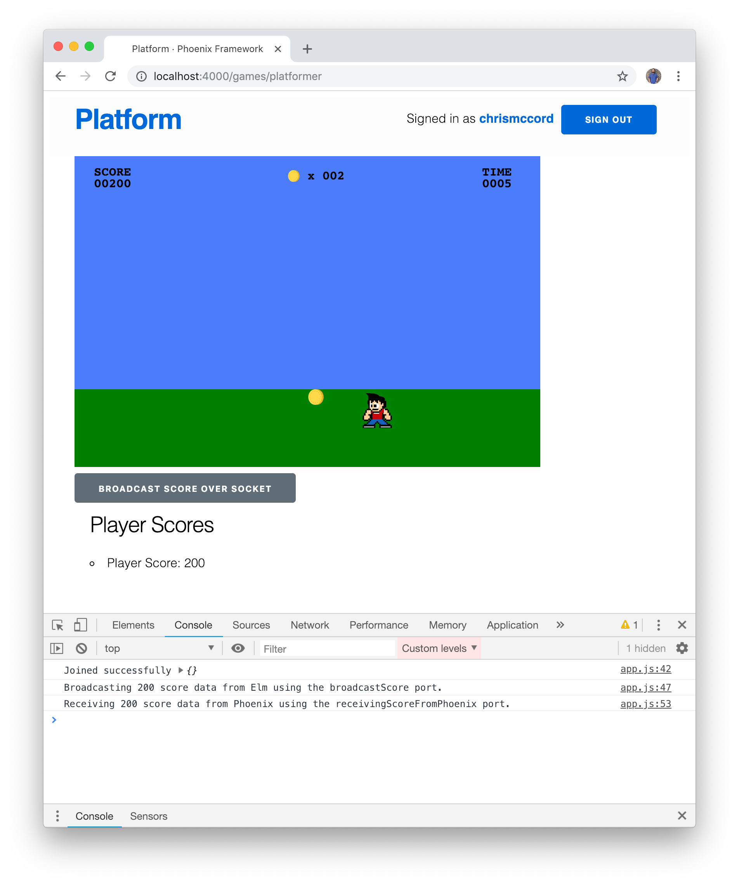
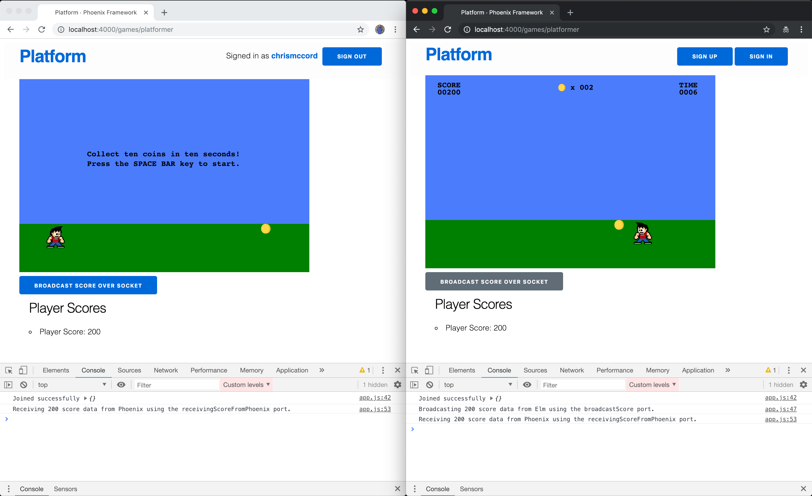

# Syncing Score Data

In the last chapter, we managed to successfully set up our Phoenix channel and
send data out from our Elm application. Now, let's figure out how to receive
data back into our Elm application and display it on the page.

## Gameplays

Let's start with our model and use it to store a list of "gameplays" that
contain a player's score. We'll create a new type alias for `Gameplay` records,
and we can later extend this with additional fields.

```elm
type alias Gameplay =
    { playerScore : Int
    }
```

And next we'll update our `Model` type to include a list of `gameplays`:

```elm
type alias Model =
    { characterDirection : Direction
    , characterPositionX : Int
    , characterPositionY : Int
    , gameplays : List Gameplay
    , gameState : GameState
    , itemPositionX : Int
    , itemPositionY : Int
    , itemsCollected : Int
    , playerScore : Int
    , timeRemaining : Int
    }
```

We'll update our `initialModel` to start with an empty list for our `gameplays`
value:

```elm
initialModel : Model
initialModel =
    { characterDirection = Right
    , characterPositionX = 50
    , characterPositionY = 300
    , gameplays = []
    , gameState = StartScreen
    , itemPositionX = 500
    , itemPositionY = 300
    , itemsCollected = 0
    , playerScore = 0
    , timeRemaining = 10
    }
```

## Displaying Gameplays

Now that we have a place to store our gameplays, let's add view functions at
the bottom of our `Platformer.elm` file so we can display the scores.

We'll start out with a `viewGameplaysIndex` function that we can use to display
a section for our player scores if any exist:

```elm
viewGameplaysIndex : Model -> Html Msg
viewGameplaysIndex model =
    if List.isEmpty model.gameplays then
        div [] []

    else
        div [ Html.Attributes.class "gameplays-index container" ]
            [ h2 [] [ text "Player Scores" ]
            , viewGameplaysList model.gameplays
            ]
```

Since we're using a handful of new HTML elements, let's go ahead and update the
`import` at the top of our file too. We'll update the `Html` import to include
elements to display our heading and list of gameplays:

```elm
import Html exposing (Html, button, div, h2, li, ul)
```

Then, we can create a `ul` element to create the list of scores and use
`List.map` to iterate through all the scores and display them in `li`
elements.

```elm
viewGameplaysList : List Gameplay -> Html Msg
viewGameplaysList gameplays =
    ul [ Html.Attributes.class "gameplays-list" ]
        (List.map viewGameplayItem gameplays)


viewGameplayItem : Gameplay -> Html Msg
viewGameplayItem gameplay =
    li [ Html.Attributes.class "gameplay-item" ]
        [ text ("Player Score: " ++ String.fromInt gameplay.playerScore) ]
```

Lastly, we'll need to add our new gameplay view functions to the main `view`
function to render any gameplays on the page.

```elm
view : Model -> Html Msg
view model =
    div [ class "container" ]
        [ viewGame model
        , viewBroadcastScoreButton model
        , viewGameplaysIndex model
        ]
```

Keep in mind that we don't have any gameplays to display on the screen yet, so
we won't see any changes if we load our application in the browser. Let's take
care of that next.

## Receiving Score Data from Phoenix

We now have a place in our model to hold player scores. And we have our view
configured to display the results. We also took care of most of the hard work
in the last chapter by setting up a channel to broadcast scores to any players
that are connected to the socket.

In other words, we're successfully sending score data _out_ of our Elm
application, and now we can set up a new port to handle data coming back _in_.

The good news is that the data is already being broadcast from Phoenix, we're
just not "listening" to the channel yet.

Let's start by creating a new port called `receiveScoreFromPhoenix` in our Elm
application. But this time we'll see that it returns a subscription (for
receiving data) instead of a command (for sending data).

```elm
-- PORTS

port broadcastScore : Encode.Value -> Cmd msg

port receiveScoreFromPhoenix : (Encode.Value -> msg) -> Sub msg
```

This is creating a port where we can listen for encoded JSON data from outside
our Elm application, and use a subscription to handle the results. Let's update
our `subscription` function with the following:

```elm
subscriptions : Model -> Sub Msg
subscriptions model =
    Sub.batch
        [ -- ...
        , receiveScoreFromPhoenix ReceiveScoreFromPhoenix
        ]
```

With this change, we're subscribing to the data coming in through our
`receiveScoreFromPhoenix` port, and now we can create a
`ReceiveScoreFromPhoenix` message in our `update` function to handle the data.

Let's add to our `Msg` type to include `ReceiveScoreFromPhoenix`, which takes
in `Encode.Value` as an argument:

```elm
type Msg
    = BroadcastScore Encode.Value
    | CountdownTimer Time.Posix
    | GameLoop Float
    | KeyDown String
    | NoOp
    | ReceiveScoreFromPhoenix Encode.Value
    | SetNewItemPositionX Int
```

And we can add a branch to the `case` expression inside our `update` function:

```elm
update : Msg -> Model -> ( Model, Cmd Msg )
update msg model =
    case msg of
        -- ...

        ReceiveScoreFromPhoenix incomingJsonData ->
            ( model, Cmd.none )
```

This should get us back to a point where our application can compile again,
even if we aren't successfully receiving the score changes yet. We managed to
set up the port, the subscription, and the update function. Now we can use
`ReceiveScoreFromPhoenix` inside our `update` function to decode the JSON
coming into our application and store it in our list of `gameplays`.

## Decoding JSON and Storing Gameplays in the Model

Below our `update` function, let's create a decoder function to handle the
incoming JSON gameplay data. This allows us to ensure the data coming into
our application matches the `Gameplay` type we created earlier. This will
also allow us to extend the decoder with additional fields later.

```elm
decodeGameplay : Decode.Decoder Gameplay
decodeGameplay =
    Decode.map Gameplay
        (Decode.field "player_score" Decode.int)
```

Now we can update `ReceiveScoreFromPhoenix` to handle the incoming JSON data.
We'll use [`Decode.decodeValue`](https://package.elm-lang.org/packages/elm-lang/core/latest/Json-Decode#decodeValue)
along with our `decodeGameplay` decoder to handle the `incomingJsonData`.

We can use a `case` expression to handle the results. When we successfully
decode the player score data, we can append that to our list of `gameplays`
in the `model`. If we get an error, we're going to leave the `model` unchanged
and use `Debug.log` so we can see the reason it failed in the DevTools console.

```elm
ReceiveScoreFromPhoenix incomingJsonData ->
    case Decode.decodeValue decodeGameplay incomingJsonData of
        Ok gameplay ->
            Debug.log "Successfully received score data."
                ( { model | gameplays = gameplay :: model.gameplays }, Cmd.none )

        Err message ->
            Debug.log ("Error receiving score data: " ++ Debug.toString message)
                ( model, Cmd.none )
```

This is admittedly a lot to look at, but the idea is that when we're working
with JSON coming from the outside world there's _a lot_ that can go wrong so
we're trying to be as intentional as possible. We're using `Debug.log` messages
so we're aware of what's happening when things go right or wrong. And we're
only altering our `model.gameplays` list when we have data coming in with the
right type and shape that we're looking for.

## Using JavaScript to Pull Data from Phoenix into Elm

We just have one big step left to get this feature up and running. The Phoenix
channel is already set up to broadcast the data, and the Elm application is all
set to receive that data. Let's finish configuring our port in the
`assets/js/app.js` file.

In the last chapter, we used `channel.push("broadcast_score", ...)` to send
data out over the channel. This time, we're going to use
`channel.on("broadcast_score", ...)` to listen for the `"broadcast_score"`
message on the channel.

```javascript
if (platformer) {
  // ...

  channel.on("broadcast_score", payload => {
    // payload.player_score will contain our score data
  })
}
```

We also used `app.ports.broadcastScore.subscribe(...)` in the last chapter when
we sent data out of our Elm application. Now we can take a similar approach and
use `app.ports.receiveScoreFromPhoenix.send(...)` to send data back into our
Elm application:

```javascript
channel.on("broadcast_score", payload => {
  console.log(`Receiving ${payload.player_score} score data from Phoenix using the receivingScoreFromPhoenix port.`);
  app.ports.receiveScoreFromPhoenix.send({
    player_score: payload.player_score
  });
});
```

With the channels and ports all working together, we did it! Elm and Phoenix
and JavaScript are all now communicating to successfully send and receive the
player score data over the socket.



We've not only been successful in sending data over the socket, we can also
open multiple browser windows now and see the data being broadcast. In this
screenshot, we can see the player on the right collected a couple of coins
and triggered a broadcast of the score data. And both the left and right
sides of the screen were able to receive the score data and display it on
the page.



## Summary

In the last two chapters, we've managed to successfully configure Elm ports and
Phoenix channels to send data over the socket. And we're now able to render the
results for players to see.

But you might have noticed we're rendering the player scores without actually
being able to tell which player did the scoring. Players are able to log into
their accounts on the Phoenix platform, but we're not able to tell who is who
on the client side yet. In the next chapter, we'll tackle socket
authentication, which will allow us to track scores for different players as
they join the channel. We'll also take a look at saving our scores to the
database before putting some finishing touches on our application.
